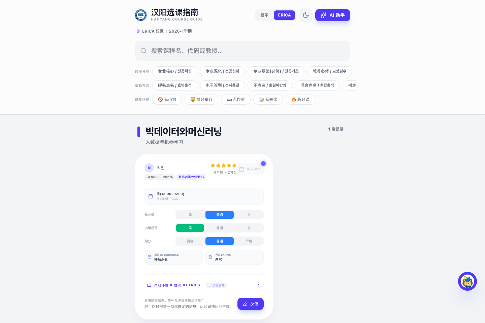
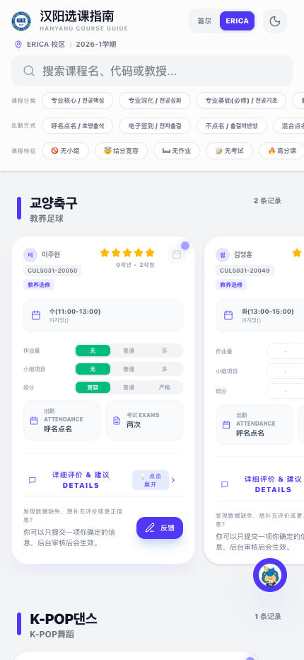

# Hanyang University Course Review System

[中文](./README.md) | [한국어](./README.ko.md)

A course review and AI-assisted course selection website for Hanyang University students.

- Live demo: <https://hanyang.eu.cc>
- GitHub metadata: [docs/github-metadata.md](./docs/github-metadata.md)
- Architecture and site logic: [docs/architecture.md](./docs/architecture.md)
- Data model: [docs/data-model.md](./docs/data-model.md)
- Data source note: [docs/data-source.md](./docs/data-source.md)
- Contributing: [CONTRIBUTING.md](./CONTRIBUTING.md)
- Security: [SECURITY.md](./SECURITY.md)

## Preview

### Desktop



### Mobile



## What The Project Does

The current project includes:

- course browsing, search, and filtering
- course detail pages
- user submissions for reviews, supplements, and corrections
- admin review workflow
- AI course assistant
- RAG retrieval with Supabase `pgvector`

## How The Data Was Prepared

My own approach was roughly this:

1. use crawler scripts or browser developer tools to collect course-related information and user review data from relevant Everytime pages
2. group multiple user reviews for the same course
3. use AI to summarize them into fields that are easier to display and retrieve, such as:
   - pros
   - cons
   - advice
   - workload
   - team project burden
   - grading style
   - attendance style
   - exam count
4. store those results in the website data tables
5. use the processed course records for search, frontend display, and the AI assistant

If you have a different way to prepare the data, that is also fine.

More details:

- [docs/data-source.md](./docs/data-source.md)
- [docs/architecture.md](./docs/architecture.md)

## AI Assistant And RAG

The assistant is not just a plain chat box.

The flow is roughly:

1. user asks a question
2. the question is converted into an embedding
3. `match_courses` retrieves relevant courses
4. campus, semester, and category filters are applied
5. the matched courses are passed into the model for the final answer

## Data Model

The core pieces are:

- `course_reviews`
- `course_feedback_submissions`
- `match_courses`

Detailed field descriptions:

- [docs/data-model.md](./docs/data-model.md)

## Local Setup

```bash
npm install
cp .env.example .env
npm run dev
```

Default URLs:

- Frontend: `http://localhost:3000/`
- Admin: `http://localhost:3000/admin`

Database setup:

- Run [`supabase_setup.sql`](./supabase_setup.sql) in Supabase SQL Editor

## Adapting It To Other Korean Universities

The current project is built around Hanyang University, but the structure is not limited to Hanyang.

If you want to adapt it to another Korean university, you would usually change:

- school name and wording
- campus definitions
- category system
- data collection method
- normalization rules
- embedding generation process

So the accurate description is:

- current project: Hanyang University course review system
- architecture: adaptable to a broader Korean university course review platform
